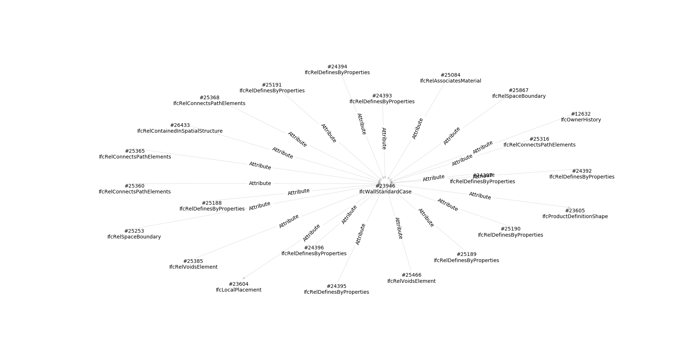

# IfcGraph


```python
#graph.py

import ifcopenshell
import ifcgraph
import sys

fn = sys.argv[1]
ifc_file = ifcopenshell.open(fn)

G = ifcgraph.create_graph(ifc_file)        
SG = ifcgraph.get_subgraph(23946, G)

ifcgraph.draw_graph(SG)
```

```

```

